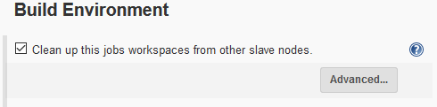
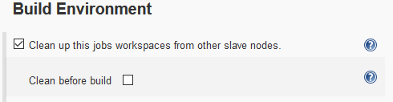
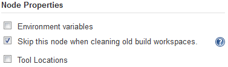
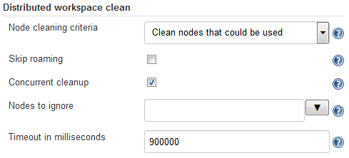

# Distributed Workspace Clean plugin

## Overview

The
Distributed Workspace Clean plugin
is used to remove unnecessary old build workspaces from nodes used by previous builds.
This allows us to keep the overall disk usage down on long-lifetime nodes that do lots of different builds.
The "Workspace" link for a job only ever points to the most recently used node,
so that means that all nodes except one could safely delete their unused workspaces
... but Jenkins does not do that by default.

This plugin is designed to clean the build's workspace in all nodes _except_ the one(s) where it is currently running.

e.g. if you have 100 jobs that typically uses 1gig of disk to build,
and you have 100 nodes that can build those jobs,
then _without this plugin_ you will eventually end up with a copy of every workspace on every node,
10000gigs total.
However, with this plugin active on every build,
you'd only keep one workspace for each job across all the nodes,
100gigs total, which is a lot less data to back up etc.

* If you have a lot of static nodes then you may find this useful.
* If you only have dynamic cloud-provided disposable nodes then you probably won't.

**Note:** This plugin was originally developed before pipeline builds existed.
It's intended for use with "classic" builds.

## Usage

### How to use it

This functionality can be enabled by ticking the box in the "Build Environment" section of a job's configuration.

... and optionally expanding the "Advanced" box and ticking the "clean before" checkbox
if you would prefer the clean to happen at the start of the build instead of at the end (the default).

### How to avoid it

If you have nodes that should never have their workspaces cleaned
(by this plugin)
then you can add a Node Property specifying
(in the node's configuration page)
that this plugin should always skip them:

For example,
nodes that are dynamically created
(and deleted)
by a cloud plugin are unlikely to require cleaning
(as they'll be destroyed before they have a chance to build up much mess),
so it's useful to add this Node Property to the template(s) from which such nodes are created.

Note:
If you can't add a node property due to limitations on the type of node
(e.g. not all cloud plugins support node properties),
you can achieve the same effect using the "Nodes to ignore" field in the global configuration.

### How to control it

Further options to control which nodes are selected for cleanup can be found in the global configuration page
(Manage Jenkins -> Configure System):

The default setting is to "clean nodes that could be used"
(for the build),
which preserves the behavior of plugin version 1.0.5 and earlier
(where the plugin looks at what other nodes could have been used to run the build,
and cleans the workspace that would've been used on each of those).
As of version 1.0.6 onwards, you can choose to clean only where previous completed builds had run, or both.

For further details, see the help text associated with each configuration option.

## See also
* [Software licence](LICENSE)
* Support and [contribution guide](CONTRIBUTING.md)
* [Changelog](CHANGELOG.md)
